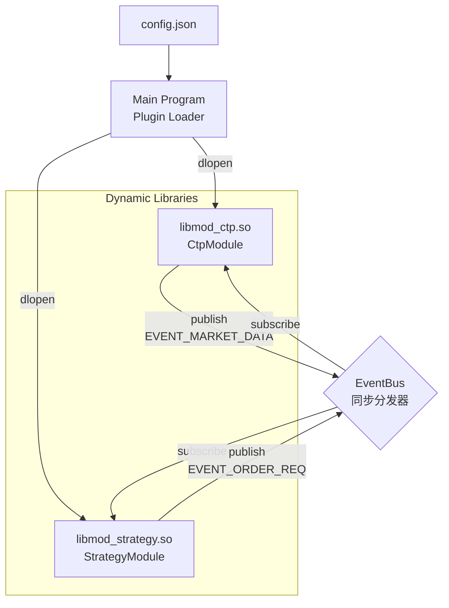

# HFT Event-Driven Architecture (HFT-EDA)

## 1. 核心设计哲学
- **Zero Copy**: 事件在总线上传递时仅传递指针（`void*`），杜绝内存拷贝。
- **Lock Free**: 在关键路径（Hot Path）上采用同步调用，避免互斥锁。
- **Plugin Architecture**: 基于动态库（`.so`）的插件系统，支持运行时加载和配置。
- **Hot Path Optimization**: 
  - `Market Data` -> `Strategy` -> `Order Execution` 采用同步事件分发，确保低延迟。
  - 非关键任务（如日志）可通过独立模块异步处理。

## 2. 系统拓扑



## 3. 核心组件

### A. Infrastructure (基础设施层)

#### EventBus (事件总线)
- **实现**: `EventBusImpl` 类，基于 `std::array<std::vector<Handler>, MAX_EVENTS>` 的同步分发器
- **接口**: 
  - `subscribe(EventType type, Handler handler)`: 订阅事件
  - `publish(EventType type, void* data)`: 发布事件（同步调用所有订阅者）
  - `clear()`: 清空所有回调（用于安全退出）

#### EventType (事件类型枚举)
```cpp
enum EventType {
    EVENT_MARKET_DATA = 0,  // 行情数据
    EVENT_ORDER_REQ,        // 报单请求
    EVENT_LOG,              // 日志事件
    MAX_EVENTS
};
```

#### Event Payloads (事件负载结构)
- **MarketData**: 包含 `symbol`, `last_price`, `volume`
- **OrderReq**: 包含 `symbol`, `direction` ('B'/'S'), `price`, `volume`

### B. Plugin System (插件系统)

#### IModule (插件接口)
所有插件必须实现 `IModule` 接口：
```cpp
class IModule {
    virtual void init(EventBus* bus, const ConfigMap& config) = 0;
    virtual void start() {}  // 可选
    virtual void stop() {}   // 可选
};
```

#### 插件导出机制
使用 `EXPORT_MODULE(ClassName)` 宏导出 `create_module()` 函数：
```cpp
#define EXPORT_MODULE(CLASS_NAME) \
    extern "C" { \
        IModule* create_module() { return new CLASS_NAME(); } \
    }
```

#### 插件加载流程
1. 主程序读取 `config.json`（使用 RapidJSON 解析）
2. 遍历 `plugins` 数组，对每个启用的插件：
   - 使用 `dlopen()` 加载 `.so` 库
   - 使用 `dlsym()` 获取 `create_module` 函数指针
   - 调用 `create_module()` 创建模块实例
   - 调用 `init(bus, config)` 初始化模块
   - 调用 `start()` 启动模块（如果实现）
3. 运行主循环
4. 退出时调用 `stop()`，清空 EventBus，释放插件

### C. 实际模块实现

#### CtpModule (`modules/ctp/ctp_module.cpp`)
- **功能**: 模拟 CTP 行情推送和报单处理
- **订阅**: `EVENT_ORDER_REQ`（接收报单请求）
- **发布**: `EVENT_MARKET_DATA`（模拟行情推送）
- **配置参数**: `symbol`
- **实现细节**: 
  - `start()` 时启动独立线程模拟行情推送
  - 使用 `std::atomic<bool>` 控制线程生命周期

#### StrategyModule (`modules/strategy/simple_strategy.cpp`)
- **功能**: 网格策略，基于价格阈值触发买卖
- **订阅**: `EVENT_MARKET_DATA`（接收行情）
- **发布**: `EVENT_ORDER_REQ`（发送报单请求）
- **配置参数**: `buy_thresh`, `sell_thresh`
- **策略逻辑**:
  - `last_price < buy_thresh`: 触发买单（'B'）
  - `last_price > sell_thresh`: 触发卖单（'S'）

## 4. 配置文件格式

`config.json` 采用 JSON 格式，支持插件级别的启用/禁用：

```json
{
    "plugins": [
        {
            "name": "CTP_Market",
            "library": "./libmod_ctp.so",
            "enabled": true,
            "config": {
                "symbol": "rb2410",
                "front_addr": "tcp://180.168.146.187:10211",
                "broker_id": "9999",
                "account": "00001"
            }
        },
        {
            "name": "Grid_Strategy_A",
            "library": "./libmod_strategy.so",
            "enabled": true,
            "config": {
                "buy_thresh": "3480.0",
                "sell_thresh": "3520.0",
                "max_pos": "10"
            }
        }
    ]
}
```

## 5. 关键路径代码示例

### 行情数据流
```cpp
// CtpModule::start() - 模拟行情推送
void start() override {
    worker_ = std::thread([this]() {
        MarketData md;
        md.last_price = price;
        // 发布行情事件（零拷贝，传递指针）
        bus_->publish(EVENT_MARKET_DATA, &md);
    });
}

// StrategyModule::init() - 订阅行情
void init(EventBus* bus, const ConfigMap& config) override {
    bus_->subscribe(EVENT_MARKET_DATA, [this](void* d) {
        this->onTick(static_cast<MarketData*>(d));
    });
}

// StrategyModule::onTick() - 策略逻辑
void onTick(MarketData* md) {
    if (md->last_price < buy_thresh_) {
        OrderReq req;
        req.direction = 'B';
        req.price = md->last_price;
        // 发布报单请求
        bus_->publish(EVENT_ORDER_REQ, &req);
    }
}
```

## 6. 构建系统

使用 CMake 构建：
- **主程序**: `hft_engine` (可执行文件)
- **插件库**: 
  - `libmod_ctp.so` (CTP 模块)
  - `libmod_strategy.so` (策略模块)
- **依赖**: 
  - RapidJSON (JSON 解析)
  - `dl` (动态库加载)
  - `pthread` (线程支持)

## 7. 目录结构

```
hft_eb/
├── include/
│   └── framework.h          # 框架接口定义
├── src/
│   └── main.cpp             # 主程序（插件加载器）
├── modules/
│   ├── ctp/
│   │   └── ctp_module.cpp   # CTP 模块实现
│   └── strategy/
│       └── simple_strategy.cpp  # 策略模块实现
├── config.json              # 插件配置文件
├── CMakeLists.txt           # 构建配置
└── ARCHITECTURE.md          # 本文档
```
