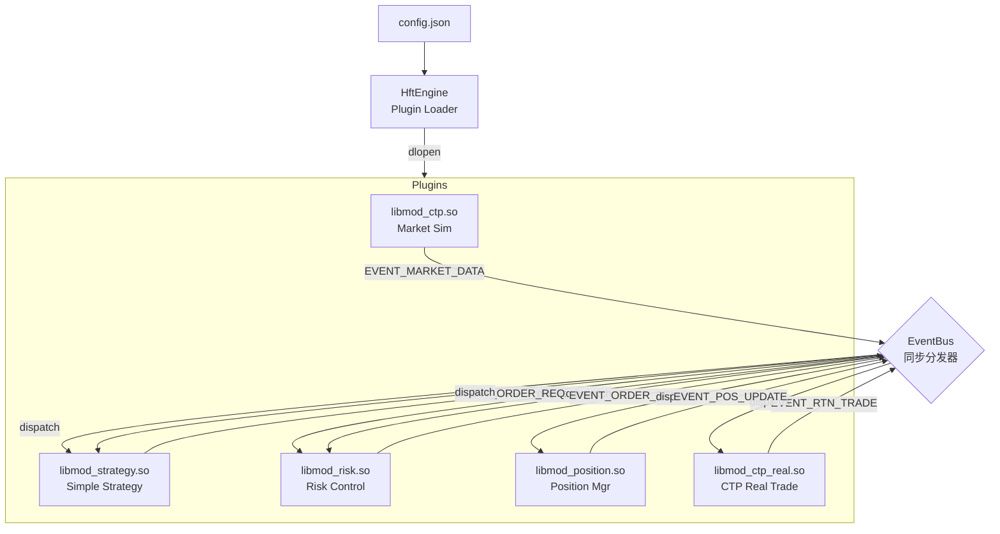

# HFT Event-Driven Architecture (HFT-EDA)

## 1. 核心设计哲学
- **Zero Copy**: 事件在总线上传递时仅传递指针（`void*`），杜绝内存拷贝。
- **Lock Free**: 在关键路径（Hot Path）上采用单线程同步调用，避免互斥锁竞争。
- **Plugin Architecture**: 基于动态库（`.so`）的插件系统，支持运行时加载和配置。
- **Risk First**: 风控模块作为交易的强制前置过滤器。

## 2. 系统拓扑 (Updated)



## 3. 核心组件

### A. Infrastructure (基础设施层)
- **HftEngine**: 管理插件生命周期。
- **EventBus**: 同步事件分发器。

### B. Protocol (`framework.h`)
- `EVENT_MARKET_DATA`: 行情 (Symbol, Price, Vol)
- `EVENT_ORDER_REQ`: 策略意图 (由策略发出，未风控)
- `EVENT_ORDER_SEND`: 交易指令 (由风控发出，已批准)
- `EVENT_RTN_TRADE`: 成交回报 (由 CTP 回调发出)
- `EVENT_POS_UPDATE`: 持仓状态 (由持仓模块计算后发出)

### C. 模块清单

#### 1. Strategy Module (`modules/strategy`)
- **功能**: 简单的网格/趋势策略。
- **逻辑**: 监听 `MARKET_DATA` 和 `POS_UPDATE`，根据持仓状态决定开平方向，发布 `ORDER_REQ`。

#### 2. Risk Module (`modules/risk`)
- **功能**: 交易前风控。
- **逻辑**: 拦截 `ORDER_REQ`，检查流控（每秒最大单量），通过则发布 `ORDER_SEND`，否则打印日志拒绝。

#### 3. Position Module (`modules/position`)
- **功能**: 持仓账本。
- **逻辑**: 监听 `RTN_TRADE`，区分今/昨仓进行累加或扣减，发布 `POS_UPDATE`。

#### 4. CTP Real Module (`modules/ctp_real`)
- **功能**: 实盘交易执行。
- **逻辑**: 监听 `ORDER_SEND`，调用 CTP API 发单；将 CTP 回调转换为 `RTN` 事件发布。

#### 5. CTP Sim Module (`modules/ctp`)
- **功能**: 模拟行情源。
- **逻辑**: 随机游走生成价格，模拟交易所推送。

## 4. 目录结构 (Updated)

```
hft_eb/
├── include/
│   ├── framework.h          # 核心协议定义
│   └── engine.h             # 引擎类
├── src/
│   ├── main.cpp             # 入口
│   └── engine.cpp           # 实现
├── modules/
│   ├── ctp/                 # 模拟行情
│   ├── ctp_real/            # 实盘交易 (CTP)
│   ├── risk/                # 风控模块
│   ├── position/            # 持仓模块
│   └── strategy/            # 策略逻辑
├── conf/
│   ├── config.json          # 默认配置
│   └── config_full.json     # 全功能闭环配置
├── docs/
│   ├── roadmap.md           # 开发路线图
│   ├── risk_design.md       # 风控设计
│   └── position_design.md   # 持仓设计
├── build/                   # CMake 中间产物
├── bin/                     # 可执行文件与 .so
└── GEMINI.md                # 本文档
```

## 5. 构建与运行

### 编译
```bash
bash build_release.sh
```

### 运行全功能闭环测试
```bash
cd bin
./hft_engine ../conf/config_full.json
```
*(注意：需要修改 config_full.json 中的 CTP 账户信息)*