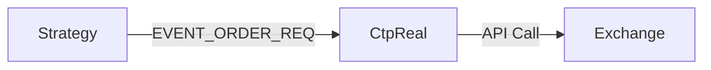
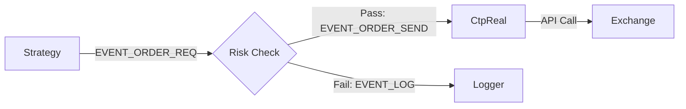

# HFT Risk Management Design

## Core Philosophy: Pre-Trade Risk Check
风控模块充当策略与执行网关之间的**强制拦截器**。所有交易请求必须经过风控模块的批准才能发送至交易所。

## Event Flow Architecture

### Current Flow (Unsafe)


### Proposed Flow (Safe)


## Implementation Steps

### 1. Update Framework (`framework.h`)
- Add new event type: `EVENT_ORDER_SEND`.
- `EVENT_ORDER_REQ`: Represents the *intention* to trade (generated by Strategy).
- `EVENT_ORDER_SEND`: Represents the *authorized* command to trade (generated by Risk).

### 2. Create Risk Module (`modules/risk/risk_module.cpp`)
#### Responsibilities:
1.  **Subscribe** to `EVENT_ORDER_REQ`.
2.  **Subscribe** to `EVENT_MARKET_DATA` (for price sanity checks).
3.  **Perform Checks**:
    - **Order Rate Limit (Flow Control)**: Max $N$ orders per second (Token Bucket or Sliding Window).
    - **Price Limit (Fat Finger)**: Reject orders deviating $> X\%$ from last market price.
    - **Self-Match Prevention**: (Optional) Maintain active order book to prevent self-crossing.
4.  **Publish**:
    - If passed: `EVENT_ORDER_SEND` (with original payload).
    - If blocked: `EVENT_LOG` (with warning message).

### 3. Update Execution Module (`modules/ctp_real/ctp_real_module.cpp`)
- Change subscription from `EVENT_ORDER_REQ` to `EVENT_ORDER_SEND`.
- This ensures `CtpReal` *only* listens to approved orders.

### 4. Configuration
Add `mod_risk` to `config.json` chain:

```json
{
    "plugins": [
        { "name": "CTP_Market", ... },
        { "name": "Grid_Strategy", ... },
        { "name": "Risk_Control", "library": "./libmod_risk.so", "config": { "max_orders_per_sec": "5", "price_deviation": "0.02" } },
        { "name": "CTP_Trade_Real", ... }
    ]
}
```

## Future Extensions
- **Position Limits**: Hard cap on total net position.
- **Instrument Whitelist**: Only allow trading specific symbols.
- **Kill Switch**: Global boolean flag to halt all trading instantly.
