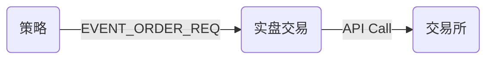
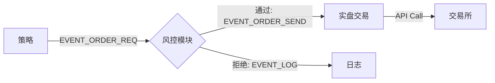

# HFT 风控模块设计文档 (Risk Management Design)

## 核心理念：交易前风控 (Pre-Trade Risk Check)
风控模块充当策略与执行网关之间的**强制拦截器**。所有交易请求必须经过风控模块的批准才能发送至交易所，这是高频交易系统的最后一道防线。

## 事件流架构 (Event Flow)

### 当前流程 (不安全)


### 提议流程 (安全)


## 实施步骤

### 1. 更新框架 (`framework.h`)
- 新增事件类型：`EVENT_ORDER_SEND`。
- `EVENT_ORDER_REQ`：代表交易**意图**（由策略生成）。
- `EVENT_ORDER_SEND`：代表已**授权**的指令（由风控生成）。

### 2. 创建风控模块 (`modules/risk/risk_module.cpp`)
#### 职责：
1.  **订阅** `EVENT_ORDER_REQ`。
2.  **订阅** `EVENT_MARKET_DATA` (用于价格合理性检查)。
3.  **执行检查**：
    - **流控 (Flow Control)**：限制每秒最大报单数（如 Token Bucket 算法）。
    - **价控 (Price Limit)**：拒绝偏离最新价超过 $X\%$ 的“胖手指”报单。
    - **自成交检查 (Self-Match)**：(可选) 维护未成交订单列表，防止自己吃自己的单子。
4.  **发布**：
    - 如果通过：发布 `EVENT_ORDER_SEND` (携带原始数据)。
    - 如果拦截：发布 `EVENT_LOG` (携带警告信息)。

### 3. 更新执行模块 (`modules/ctp_real/ctp_real_module.cpp`)
- 将订阅从 `EVENT_ORDER_REQ` 改为 `EVENT_ORDER_SEND`。
- 这确保了实盘模块**只**执行经过批准的订单。

### 4. 配置文件 (`config.json`)
在插件链中加入 `mod_risk`：

```json
{
    "plugins": [
        { "name": "CTP_Market", ... },
        { "name": "Grid_Strategy", ... },
        { "name": "Risk_Control", "library": "./libmod_risk.so", "config": { "max_orders_per_sec": "5", "price_deviation": "0.02" } },
        { "name": "CTP_Trade_Real", ... }
    ]
}
```