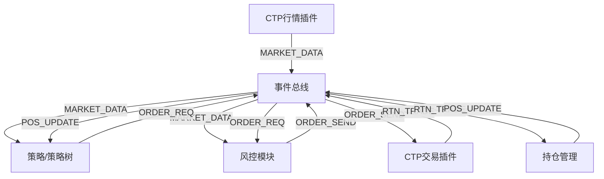

# HFT 系统开发路线图 (Roadmap)

## 第一阶段：核心基础设施 (已完成)
- [x] **事件总线 (EventBus)**: 零拷贝、同步事件分发机制。
- [x] **插件架构 (Plugin Architecture)**: 支持 `.so` 动态加载及生命周期管理 (`init`, `start`, `stop`)。
- [x] **协议定义 (`framework.h`)**:
    - `EVENT_MARKET_DATA` (行情数据)
    - `EVENT_ORDER_REQ` (策略交易意图)
    - `EVENT_ORDER_SEND` (经风控批准的指令)
    - `EVENT_RTN_ORDER` / `EVENT_RTN_TRADE` (交易所状态与成交回报)

## 第二阶段：核心业务模块 (进行中)

### 1. 风险控制模块 (Risk Management) - 已完成
- [x] **角色**: 交易前的“防火墙”。
- [x] **功能**: 
    - 报单频率限制 (流控)。
    - 拦截 `EVENT_ORDER_REQ` -> 审核后发布 `EVENT_ORDER_SEND`。
- [ ] **后续**: 增加价格偏离检查 (防胖手指)。

### 2. CTP 执行模块 (CTP Execution) - 已完成
- [x] **角色**: 接入实盘/模拟柜台 (上期所/SimNow)。
- [x] **功能**:
    - 订阅 `EVENT_ORDER_SEND`。
    - 处理 `ReqOrderInsert`。
    - 发布 `EVENT_RTN_ORDER` / `EVENT_RTN_TRADE` 到总线。

### 3. 持仓管理模块 (Position Management) - 优先级：极高
- [ ] **角色**: 系统的“账本”。
- [ ] **需求**:
    - 监听 `EVENT_RTN_TRADE`。
    - 实时计算多空持仓（区分今仓、昨仓）。
    - 为策略提供持仓查询接口，实现“平仓”逻辑的正确性。
    - **核心意义**: 没有持仓管理，策略无法正确执行平仓，只能盲目开仓。

### 4. 数据网关 / UI 连接器 (Data Gateway) - 优先级：高
- [ ] **角色**: C++ 引擎与 Web 前端之间的桥梁。
- [ ] **技术**: ZeroMQ (PUB/SUB) 或 WebSocket。
- [ ] **功能**:
    - 实时广播行情。
    - 将报单和成交回报推送到 Web 面板。
    - 监控账户实时盈亏 (PnL)。

## 第三阶段：高级交易逻辑 (计划中)

### 5. 策略树 (Strategy Tree)
- [ ] **角色**: 管理复杂的多品种、多策略组合。
- [ ] **功能**:
    - 策略节点组合模式。
    - 每个节点的资金分配。
    - 运行时动态加载/卸载策略。

### 6. 数据录制器 (Data Recorder)
- [ ] **角色**: 数据持久化。
- [ ] **功能**:
    - 录制 Tick 行情到 CSV 或数据库。
    - 记录每日成交审计日志。

### 7. 系统监控 (Watchdog)
- [ ] **角色**: 系统稳定性。
- [ ] **功能**:
    - 监控模块心跳。
    - 异常崩溃报警。

## 架构数据流向图

