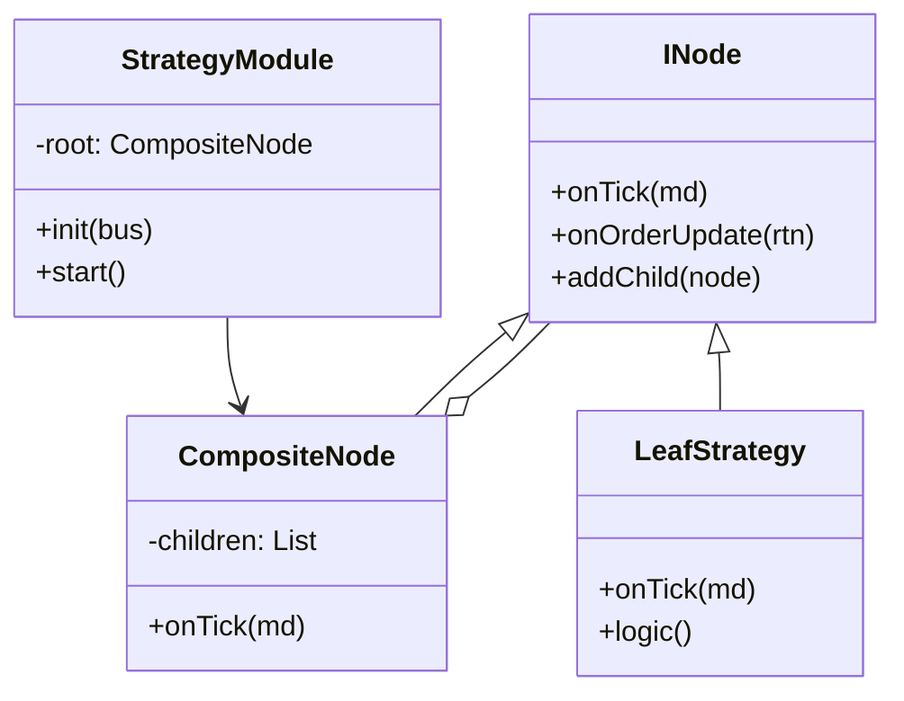

# 策略树设计文档 (Strategy Tree Design)

## 1. 核心目标
构建一个层级化的策略管理系统，以支持：
- **多策略并行 (Multi-Strategy)**: 同时运行网格、趋势、套利等多个策略。
- **资金管理 (Capital Allocation)**: 父节点控制子节点的资金上限。
- **组合风控 (Portfolio Risk)**: 在策略组层面进行净头寸控制。
- **逻辑解耦**: 将“具体交易逻辑”与“系统事件处理”分离。

## 2. 架构模式：组合模式 (Composite Pattern)

所有的策略单元都实现同一个接口 `INode`。



## 3. 接口定义 (C++)

```cpp
// 策略上下文，包含发单能力的句柄
struct StrategyContext {
    std::function<void(const OrderReq&)> send_order;
    std::function<void(const char* msg)> log;
};

class INode {
public:
    virtual ~INode() = default;
    
    // 生命周期
    virtual void init(StrategyContext* ctx, const ConfigMap& config) = 0;
    
    // 事件回调
    virtual void onTick(const MarketData* md) = 0;
    virtual void onOrderUpdate(const OrderRtn* rtn) = 0;
    
    // 树操作
    virtual void addChild(std::shared_ptr<INode> child) {}
};
```

## 4. 模块实现 (StrategyTreeModule)

`StrategyTreeModule` 是一个标准的 HFT 插件 (`IModule`)，它充当**适配器**：

1.  **订阅 EventBus**: 监听 `EVENT_MARKET_DATA`, `EVENT_RTN_ORDER` 等。
2.  **持有 Root Node**: 维护一棵策略树。
3.  **事件分发**:
    - 收到行情 -> 调用 `root->onTick(md)` -> 递归传给所有子策略。
    - 收到成交 -> 根据 `OrderRef` 或 `StrategyID` 找到对应子策略 -> `node->onOrderUpdate()`.
4.  **发单代理**:
    - 为每个节点注入 `send_order` 回调。
    - 当节点调用 `send_order` 时，Module 将其封装为 `EVENT_ORDER_REQ` 并发布到 EventBus。
    - **关键**: 在 `OrderReq` 中注入 `StrategyID`，以便回调路由。

## 5. 示例配置结构

```json
{
    "name": "StrategyTree",
    "library": "./libmod_strategy_tree.so",
    "config": {
        "root": {
            "type": "Portfolio",
            "max_risk": 100000,
            "children": [
                {
                    "type": "GridStrategy",
                    "id": "GRID_01",
                    "symbol": "rb2410",
                    "params": { "step": 10 }
                },
                {
                    "type": "TrendStrategy",
                    "id": "MA_01",
                    "symbol": "rb2410",
                    "params": { "window": 60 }
                }
            ]
        }
    }
}
```

## 6. 优势
- **统一入口**: 引擎只与 `StrategyTreeModule` 交互，不需要知道具体跑了多少个策略。
- **状态隔离**: 每个 LeafStrategy 维护自己的 `position` 和 `orders` 状态，互不干扰。
- **热插拔可能性**: 理论上可以在运行时动态 `addChild` 或 `removeChild`（需加锁）。
